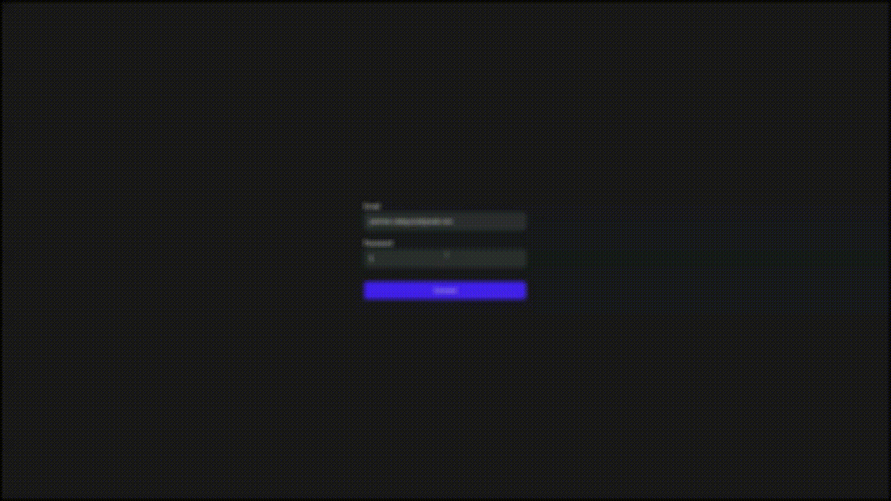

# Free RealTime Forex Prices
<p align="center">
  
</p>


<br />

### This project is a simple demonstration of how to connect the trading companies in a simple and free way.

#### **We use the broker [IQOption](https://iqoption.com/) as an example.**
<br />

## Prerequisites

* Node.js >= 14
* Dependency Manager (**yarn** was used)

<br />

## Installation
1. First, install yarn if not installed:
```bash
$ npm install -g yarn
```

2. Clone project repository:
```bash
$ git clone https://github.com/preduus/free-realtime-forex-prices.git
```

2. Install project dependences:
```bash
# Using yarn
$ yarn
```
<br />

## Usage

To see app working, run:
```bash
# Using yarn
$ yarn start

# Using npm
$ npm run start
```

### **Login page**
As we use only one broker provider, by default, the access credentials will be the same as those used to access the [IQOption](https://iqoption.com) broker.

If you don't have an account yet, [click here](https://iqoption.com/en/register).

<br />

## Features
* Login directly with broker
* Get forex latest prices
* Get forex prices in realtime

<br />

## Technology Stack
* [React](https://reactjs.org)
* [Typescript](https://www.typescriptlang.org)
* [Styled Components](https://styled-components.com/)
* [Axios](https://axios-http.com)
* [Redux](https://redux.js.org)
* [Redux Saga](https://redux-saga.js.org)
* [Formik](https://formik.org)
* [Universal Cookie](https://github.com/reactivestack/cookies/tree/master/packages/universal-cookie)
* [React useWebsocket](https://github.com/robtaussig/react-use-websocket#readme)

<br />

## 📫 Contribute to project
The project needs a lot of input for us to add more brokers providers, if you feel like helping or have some idea, please open an [issue](/../../issues) and help us.

1. Fork the project.
2. Create a branch: `git checkout -b feature/<branch_name>`.
3. Commit your code changes: `git commit -m '<message>'`
4. Push to your work branch: `git push origin feature/<branch_name>`
5. Open a pull request.

Alternatively, see on GitHub docs [How to create a pull request](https://help.github.com/en/github/collaborating-with-issues-and-pull-requests/creating-a-pull-request).

<br />

## 🤝 Contributors

<table>
  <tr>
    <td align="center">
      <a href="https://github.com/preduus">
        <br>
      </a>
    </td>
  </tr>
</table> 

<br />

## 📝 License

Distributed under the BSD 3 License. See LICENSE for more information.

[⬆ Back to top](#free-realtime-forex-prices)<br>
